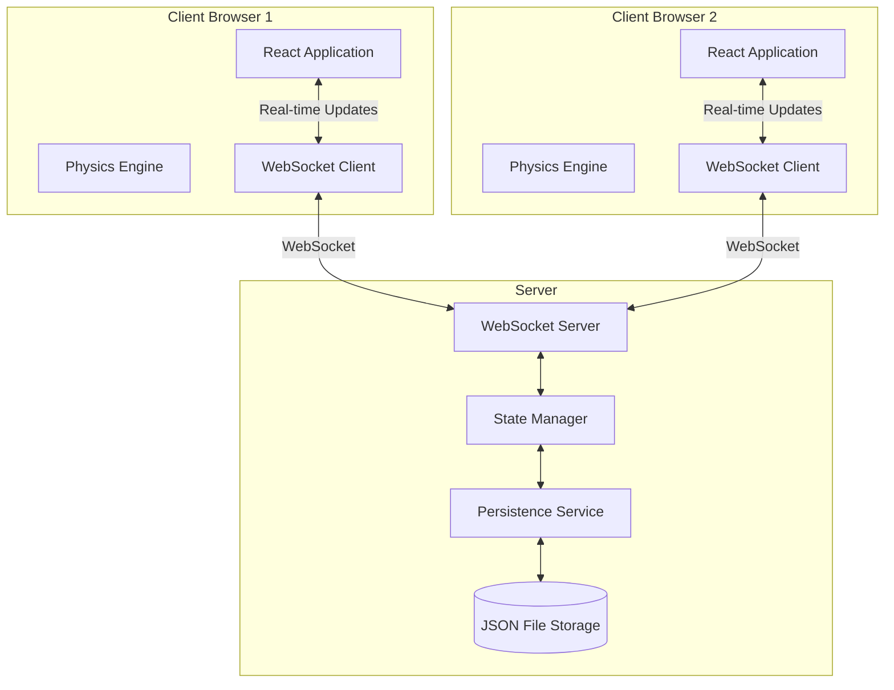

# Design Document

## Overview

The collaborative note board application is a real-time, web-based workspace that enables multiple users to create, organize, and interact with notes on an infinite canvas. The system consists of a React-based frontend client and a Node.js backend server communicating via WebSockets for real-time synchronization. The application emphasizes simplicity, reliability, and engaging user interactions through physics-based animations.

## Architecture

### System Architecture



### Technology Stack

**Frontend:**
- React 18 with TypeScript for type safety and component architecture
- Matter.js for 2D physics simulation
- Socket.io-client for WebSocket communication
- Framer Motion for smooth animations
- React-Zoom-Pan-Pinch for canvas navigation
- CSS Modules for scoped styling

**Backend:**
- Node.js with Express for HTTP server
- Socket.io for WebSocket server
- TypeScript for type safety
- File system (fs) for data persistence
- UUID for unique identifier generation

### Deployment Model

The application runs on a local network:
- Server runs on one machine (e.g., desktop or Raspberry Pi)
- Clients connect via local IP address (e.g., http://192.168.1.100:3000)
- No internet connection required for operation
- Port forwarding not needed (local network only)

## Components and Interfaces

### Frontend Components

#### 1. App Component
- Root component managing global state and routing
- Handles WebSocket connection initialization
- Manages board selection and switching

#### 2. Sidebar Component
- Displays list of available boards
- Provides board creation, deletion, and renaming controls
- Contains search functionality
- Retractable with animated transitions
- Persists collapsed/expanded state to localStorage

#### 3. Board Component
- Main canvas container with infinite scrolling
- Manages zoom and pan interactions
- Renders all notes for the current board
- Handles note creation via double-click
- Integrates physics engine for note interactions

#### 4. Note Component
- Displays individual note content
- Supports collapsed and expanded states
- Handles drag interactions
- Provides customization controls (color, gradient, font size)
- Manages text editing with contentEditable
- Supports image uploads and display
- Includes sticker placement and management
- Shows delete button with confirmation

#### 5. Physics Manager
- Wraps Matter.js engine
- Synchronizes physics bodies with React components
- Handles collision detection and response
- Applies momentum and friction to dragged notes
- Updates note positions based on physics simulation

#### 6. Customization Panel
- Color picker with preset solid colors
- Gradient selector with preset options
- Font size selector
- Sticker library browser
- Appears as overlay when note is selected

#### 7. Toolbar Component
- Zoom in/out controls
- Fit-to-screen button
- New note creation button
- Connection status indicator

### Backend Components

#### 1. WebSocket Server
- Handles client connections and disconnections
- Broadcasts note updates to all connected clients
- Manages room-based communication (one room per board)
- Implements reconnection logic with state synchronization

#### 2. State Manager
- Maintains in-memory representation of all boards and notes
- Validates incoming updates
- Resolves conflicts using last-write-wins strategy
- Provides state snapshots for reconnecting clients

#### 3. Persistence Service
- Saves board state to JSON files every 30 seconds
- Loads board state on server startup
- Implements atomic writes to prevent data corruption
- Creates backups before overwriting existing files

#### 4. API Routes
- GET /api/boards - List all boards
- POST /api/boards - Create new board
- DELETE /api/boards/:id - Delete board
- PUT /api/boards/:id - Rename board
- GET /api/boards/:id/notes - Get all notes for a board

## Data Models

### Board Model

```typescript
interface Board {
  id: string;              // UUID
  name: string;            // User-defined board name
  createdAt: number;       // Unix timestamp
  updatedAt: number;       // Unix timestamp
  notes: Note[];           // Array of notes on this board
}
```

### Note Model

```typescript
interface Note {
  id: string;              // UUID
  boardId: string;         // Parent board ID
  x: number;               // X position on canvas
  y: number;               // Y position on canvas
  width: number;           // Note width in pixels
  height: number;          // Note height in pixels
  content: string;         // Text content (HTML)
  backgroundColor: string; // Solid color or gradient CSS value
  fontSize: 'small' | 'medium' | 'large';
  isExpanded: boolean;     // Collapsed or expanded state
  images: Image[];         // Embedded images
  stickers: Sticker[];     // Attached stickers
  createdAt: number;       // Unix timestamp
  updatedAt: number;       // Unix timestamp
  editingBy?: string;      // User ID of current editor (optional)
}
```

### Image Model

```typescript
interface Image {
  id: string;              // UUID
  url: string;             // Base64 data URL or file path
  width: number;           // Display width in pixels
  height: number;          // Display height in pixels
  x: number;               // X position within note
  y: number;               // Y position within note
}
```

### Sticker Model

```typescript
interface Sticker {
  id: string;              // UUID
  type: string;            // Sticker identifier (e.g., 'heart', 'star')
  x: number;               // X position within note
  y: number;               // Y position within note
  scale: number;           // Size multiplier (0.5 to 2.0)
}
```

### WebSocket Message Model

```typescript
interface WSMessage {
  type: 'note:create' | 'note:update' | 'note:delete' | 
        'note:move' | 'board:create' | 'board:delete' | 
        'board:rename' | 'sync:request' | 'sync:response';
  payload: any;            // Type-specific payload
  timestamp: number;       // Unix timestamp
  userId: string;          // Originating user ID
}
```

## Error Handling

### Client-Side Error Handling

1. **WebSocket Connection Failures**
   - Display connection status indicator in toolbar
   - Attempt reconnection every 3 seconds with exponential backoff (max 30 seconds)
   - Queue local changes during disconnection
   - Sync queued changes upon reconnection

2. **Image Upload Failures**
   - Validate file size before upload (max 10MB)
   - Validate file type (JPEG, PNG, GIF only)
   - Display error toast notification with specific message
   - Prevent upload button from being clicked during processing

3. **Physics Engine Errors**
   - Wrap physics calculations in try-catch blocks
   - Reset physics world if corruption detected
   - Log errors to console for debugging
   - Gracefully degrade to non-physics mode if engine fails

4. **Rendering Errors**
   - Implement React Error Boundaries around Note components
   - Display fallback UI for crashed notes
   - Provide "Reload Note" button in fallback UI
   - Log component stack traces for debugging

### Server-Side Error Handling

1. **File System Errors**
   - Retry failed writes up to 3 times with 1-second delay
   - Log all file system errors with timestamps
   - Create data directory if it doesn't exist on startup
   - Validate JSON structure before writing

2. **WebSocket Errors**
   - Catch and log all message parsing errors
   - Send error response to client for invalid messages
   - Gracefully handle client disconnections
   - Clean up resources when clients disconnect

3. **State Corruption**
   - Validate all incoming state updates against schema
   - Reject invalid updates and notify client
   - Maintain backup of last known good state
   - Provide manual recovery endpoint for administrators

## Testing Strategy

### Unit Tests

**Frontend:**
- Note component rendering with different props
- Customization panel color/gradient selection
- Sidebar board list filtering and search
- Physics manager collision detection logic
- WebSocket message serialization/deserialization

**Backend:**
- State manager update validation
- Persistence service file operations
- WebSocket message routing
- API endpoint request/response handling

### Integration Tests

**Frontend:**
- Note creation flow from double-click to render
- Drag-and-drop with physics simulation
- Image upload and display within note
- Sticker addition and positioning
- Real-time update reception and rendering

**Backend:**
- WebSocket connection and message broadcast
- State persistence and loading
- Board CRUD operations via API
- Multi-client synchronization

### End-to-End Tests

- Complete user workflow: create board → add notes → customize → collaborate
- Real-time collaboration between two simulated clients
- Reconnection and state synchronization after disconnect
- Image upload and display across clients
- Physics interactions with multiple notes

### Performance Tests

- Render performance with 100+ notes on canvas
- WebSocket message throughput (messages per second)
- Physics simulation frame rate with 50+ active bodies
- Memory usage over extended session (4+ hours)
- File system write performance under load

### Manual Testing Checklist

- [ ] Visual appearance matches design mockups
- [ ] Animations feel smooth and natural (60fps target)
- [ ] Physics interactions feel realistic
- [ ] Touch/trackpad gestures work correctly
- [ ] Responsive design works on different screen sizes
- [ ] Color contrast meets accessibility standards
- [ ] Keyboard navigation works for all features
- [ ] Error messages are clear and helpful

## Design Decisions and Rationales

### 1. WebSocket vs HTTP Polling
**Decision:** Use WebSockets for real-time communication
**Rationale:** WebSockets provide lower latency (<100ms) and reduced server load compared to polling. Essential for smooth real-time collaboration experience.

### 2. Matter.js vs Custom Physics
**Decision:** Use Matter.js physics engine
**Rationale:** Mature, well-tested library with excellent performance. Implementing custom physics would be time-consuming and error-prone.

### 3. File-Based vs Database Storage
**Decision:** Use JSON file storage
**Rationale:** Simpler deployment for local network use case. No database server required. Sufficient performance for expected data volume (< 1000 notes per board).

### 4. Last-Write-Wins vs CRDT
**Decision:** Use last-write-wins conflict resolution
**Rationale:** Simpler implementation. Acceptable for 2-user scenario. CRDTs add complexity that isn't justified for this use case.

### 5. Base64 vs File Storage for Images
**Decision:** Use Base64 data URLs for images
**Rationale:** Simplifies data model (everything in JSON). Eliminates need for separate file serving. Acceptable for 10MB limit and expected usage.

### 6. React vs Vue/Svelte
**Decision:** Use React
**Rationale:** Largest ecosystem, excellent TypeScript support, mature animation libraries (Framer Motion), extensive documentation.

### 7. Framer Motion vs CSS Animations
**Decision:** Use Framer Motion for animations
**Rationale:** Declarative API integrates well with React. Handles complex animation sequences. Provides spring physics for natural motion.

### 8. Infinite Canvas vs Fixed Size
**Decision:** Implement infinite canvas
**Rationale:** Matches Apple Freeform UX. Provides freedom for spatial organization. Technical feasibility confirmed with React-Zoom-Pan-Pinch.

## Visual Design Specifications

### macOS Tahoe Design Language

The application follows macOS Tahoe's modern design principles:
- **Translucent materials** with frosted glass blur effects
- **Vibrant colors** with depth and layering
- **Smooth, fluid animations** with spring physics
- **Clean typography** with excellent readability
- **Subtle depth** through shadows and elevation
- **Rounded corners** throughout the interface

### Color Palette

**System Colors (macOS Tahoe Style):**
- Background: #F5F5F7 (light gray, system background)
- Canvas: #FFFFFF (pure white workspace)
- Sidebar: rgba(255, 255, 255, 0.7) with backdrop-filter: blur(20px)
- Accent: #007AFF (macOS blue for interactive elements)
- Text Primary: #1D1D1F (near black)
- Text Secondary: #86868B (gray)

**Note Colors (Vibrant macOS Palette):**
- Yellow: #FFD60A (vibrant yellow)
- Orange: #FF9F0A (vibrant orange)
- Red: #FF453A (vibrant red)
- Pink: #FF375F (vibrant pink)
- Purple: #BF5AF2 (vibrant purple)
- Blue: #0A84FF (vibrant blue)
- Teal: #5AC8FA (vibrant teal)
- Green: #32D74B (vibrant green)
- Gray: #E5E5EA (light gray)
- White: #FFFFFF (clean white)

**Note Gradients (macOS Style):**
- Sunset: linear-gradient(135deg, #FF9F0A 0%, #FF375F 100%)
- Ocean: linear-gradient(135deg, #5AC8FA 0%, #0A84FF 100%)
- Forest: linear-gradient(135deg, #32D74B 0%, #30D158 100%)
- Twilight: linear-gradient(135deg, #BF5AF2 0%, #FF375F 100%)
- Dawn: linear-gradient(135deg, #FFD60A 0%, #FF9F0A 100%)

### Typography

- **Primary Font:** -apple-system, BlinkMacSystemFont, 'SF Pro Display', 'Segoe UI', sans-serif
- **System Font Stack:** Matches native macOS typography
- **Note Font Sizes:**
  - Small: 13px / 1.47 line-height (400 weight)
  - Medium: 15px / 1.47 line-height (400 weight)
  - Large: 17px / 1.47 line-height (400 weight)
- **Note Title:** 15px / 1.2 line-height (600 weight - semibold)

### Note Card Structure

**Card Container:**
- Border-radius: 14px (macOS standard)
- Padding: 16px
- Background: Semi-transparent with blur
  - Light mode: rgba(255, 255, 255, 0.85)
  - Backdrop-filter: blur(20px) saturate(180%)
- Border: 0.5px solid rgba(0, 0, 0, 0.04)
- Box-shadow: 
  - Default: 0 2px 8px rgba(0, 0, 0, 0.08), 0 1px 2px rgba(0, 0, 0, 0.06)
  - Hover: 0 4px 16px rgba(0, 0, 0, 0.12), 0 2px 4px rgba(0, 0, 0, 0.08)
  - Dragging: 0 8px 32px rgba(0, 0, 0, 0.16), 0 4px 8px rgba(0, 0, 0, 0.12)

**Note Header:**
- Height: 32px
- Padding: 0 0 12px 0
- Border-bottom: 1px solid rgba(0, 0, 0, 0.06)
- Contains: Title (editable), action buttons (minimize, close)
- Font: 15px semibold

**Note Content:**
- Padding-top: 12px
- Supports: Rich text, checkboxes, images, stickers
- Line-height: 1.47 (macOS standard)
- Text color: #1D1D1F

### Spacing (macOS 8pt Grid System)

- Base unit: 8px
- Note padding: 16px (2 units)
- Note border-radius: 14px
- Sidebar width: 280px (35 units)
- Minimum note size: 240x160px
- Default note size: 280x200px
- Gap between notes: 16px (2 units)
- Header height: 32px (4 units)

### Visual Effects

**Translucency & Blur:**
- Sidebar: backdrop-filter: blur(20px) saturate(180%)
- Notes: backdrop-filter: blur(20px) saturate(180%)
- Panels: backdrop-filter: blur(40px) saturate(180%)

**Shadows (Multi-layer macOS Style):**
- Default: 
  - 0 2px 8px rgba(0,0,0,0.08)
  - 0 1px 2px rgba(0,0,0,0.06)
- Hover:
  - 0 4px 16px rgba(0,0,0,0.12)
  - 0 2px 4px rgba(0,0,0,0.08)
- Dragging:
  - 0 8px 32px rgba(0,0,0,0.16)
  - 0 4px 8px rgba(0,0,0,0.12)

**Borders:**
- Note border: 0.5px solid rgba(0,0,0,0.04)
- Dividers: 1px solid rgba(0,0,0,0.06)
- Focus ring: 3px solid rgba(0,122,255,0.3)

**Hover & Interaction States:**
- Scale: 1.02x on hover (smooth spring animation)
- Brightness: Slight increase on hover
- Cursor: grab (open hand) → grabbing (closed hand)
- Transition: all 200ms cubic-bezier(0.4, 0.0, 0.2, 1)

### Animation Timings (macOS Spring Physics)

- State transitions: 300ms cubic-bezier(0.4, 0.0, 0.2, 1)
- Note creation: 400ms spring (tension: 300, friction: 20)
- Note deletion: 250ms ease-in with fade
- Sidebar toggle: 300ms cubic-bezier(0.4, 0.0, 0.2, 1)
- Physics momentum: 2000ms max duration
- Hover scale: 200ms cubic-bezier(0.4, 0.0, 0.2, 1)
- Button press: 100ms ease-out (scale 0.95x)

### Button & Control Styling

**Primary Buttons:**
- Background: #007AFF
- Color: #FFFFFF
- Border-radius: 8px
- Padding: 8px 16px
- Font: 13px semibold
- Hover: Brightness 110%
- Active: Scale 0.95x

**Secondary Buttons:**
- Background: rgba(0,0,0,0.05)
- Color: #1D1D1F
- Border-radius: 8px
- Padding: 8px 16px
- Font: 13px regular
- Hover: Background rgba(0,0,0,0.08)

**Icon Buttons:**
- Size: 28px × 28px
- Border-radius: 6px
- Background: Transparent
- Hover: rgba(0,0,0,0.05)
- Active: rgba(0,0,0,0.1)

### Checkbox Styling (macOS Native)

**Custom Checkboxes:**
- Size: 16px × 16px
- Border: 1px solid rgba(0,0,0,0.2)
- Border-radius: 4px
- Background: #FFFFFF
- Checked: Background #007AFF, border #007AFF
- Checkmark: White ✓ icon (SF Symbols style)
- Spacing: 8px margin-right from text
- Hover: Border color #007AFF

### Sidebar Design

**Sidebar Container:**
- Width: 280px
- Background: rgba(255, 255, 255, 0.7)
- Backdrop-filter: blur(20px) saturate(180%)
- Border-right: 0.5px solid rgba(0,0,0,0.06)
- Box-shadow: 1px 0 0 rgba(0,0,0,0.02)

**Sidebar Items:**
- Height: 32px
- Padding: 0 12px
- Border-radius: 6px
- Hover: Background rgba(0,0,0,0.05)
- Selected: Background rgba(0,122,255,0.1), color #007AFF
- Font: 13px regular

### Toolbar Design

**Toolbar Container:**
- Height: 52px
- Background: rgba(255, 255, 255, 0.8)
- Backdrop-filter: blur(20px) saturate(180%)
- Border-bottom: 0.5px solid rgba(0,0,0,0.06)
- Padding: 0 16px
- Display: Flex, align-items center

**Toolbar Controls:**
- Icon buttons with 28px size
- Spacing: 8px between controls
- Tooltips on hover

### Sticker Library

**Emoji-based stickers (20 total):**
- Emotions: ❤️ 😊 😂 😍 🥰 😎 🤔 😴
- Symbols: ⭐ ✨ 🔥 💡 ✅ ❌ ⚠️ 📌
- Objects: 🎨 🎵 📷 🎯

Stickers rendered as large emoji (28px default) with scaling support (16px to 56px).

### Accessibility

- Minimum contrast ratio: 4.5:1 for text
- Focus indicators: 3px blue ring
- Keyboard navigation: Full support
- Screen reader: ARIA labels on all interactive elements
- Reduced motion: Respects prefers-reduced-motion
